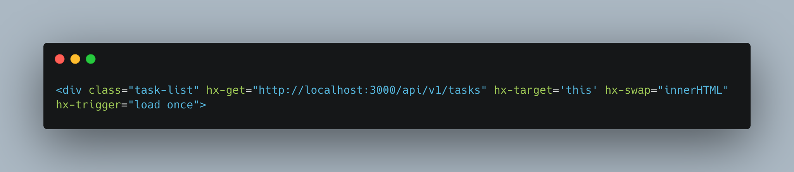
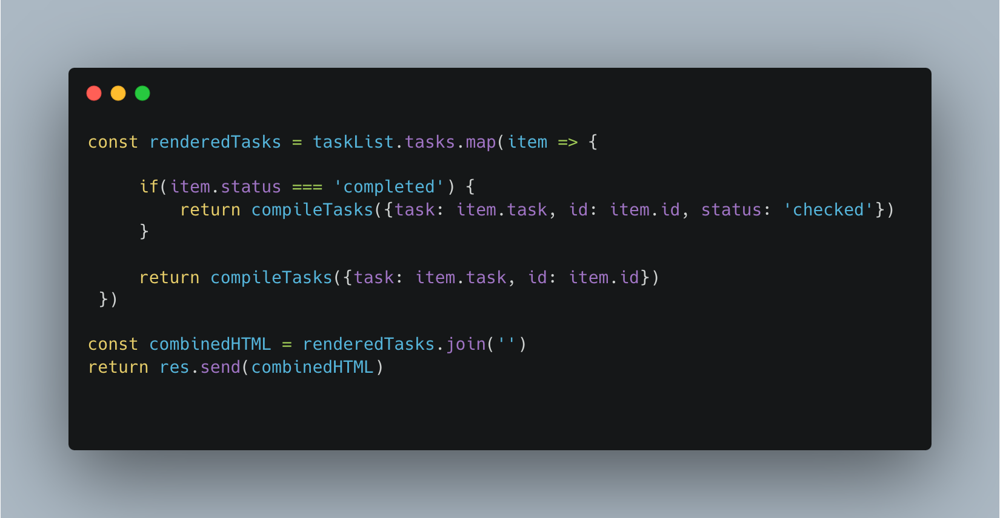

# HTMX Todo List

## Project Description

### Motivation
This project was built out of my curiosity towards HTMX. I found out about it from vidoes of The Primeagen, and wanted to see what all the hype is about. So I created a simple To-Do List app with it. 

### Stack

* HTMX
* Express
* Handlebars

### How it works
Every user can create a task, complete the task and delete a task, as well as look at all tasks that were created before. All tasks data is saved in JSON file, for the simplicity. 

#### Get Tasks

On load of the page, the get request is sent to the backend to send all the existing tasks. This is the most difficult part of the application, because backend should take those tasks from JSON, insert each task into the Handlebars template, and then send completed HTML back to the client. Overall, it looks like this:

This HTMX code requests for all tasks on the page load

Here we can see that we iterate through the list of tasks, render each one of them into Handlebars template and return. Then we take an array of HTML elements that we got, and join them to make a string, which we send to the front end for HTMX to handle.
Also we add status checked to the ones that are completed, to make sure that our tasks have filled checkbox when they are displayed on the page. 

For most of other functions, they are quite straightforward, and there is nothing much of interest to point out. 

